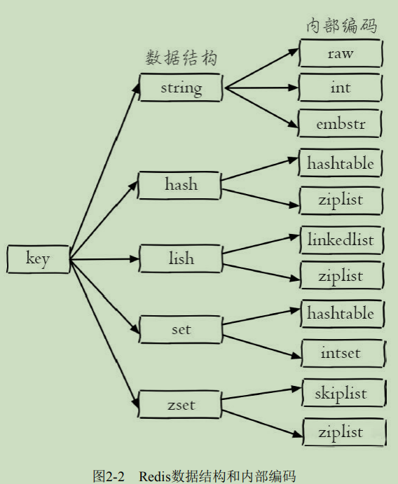

## 第2章 API的理解和使用

### 全局命令

* 查看所有键

  ```
  keys *
  ```

* 键总数

  ```
  dbsize
  ```

* 检查键是否存在

  ```
  exists key
  ```

* 删除键

  ```
  del key [key ...]
  ```

* 键过期

  ```
  expire key seconds
  ```

  * 大于等于0的整数: 键剩余的过期时间
  * -1: 键没设置过期时间
  * -2: 键不存在
  * 可通过 ttl命令观察键的剩余时间 `ttl key`

* 键的数据结构类型

  ```
  type key
  ```

  * 若键不存在,则返回none

### 数据结构和内部编码

* 查看数据结构内部的编码实现

  ```
  object encoding key
  ```

  

### 单线程架构

* 为什么采用单线程模型
  * 第一,纯内存能访问,Redis将所有数据放在内存中,内存的响应时长大约为100纳秒,这是Redis达到每秒万级别访问的重要基础
  * 第二,非阻塞I/O, Redis使用epoll作为I/O多路复用技术的实现,再加上Redis自身的事件处理模型将epoll中的连接, 读写, 关闭 都转换为事件,不在网络I/O上浪费过多的时间
  * 第三,单线程避免了线程切换和竞态产生的消耗

### 字符串

* 字符串类型的值实际可以使字符串(简单的字符串, 复杂的字符串(例如JSON, XML)),数字(整数, 浮点数),甚至是二进制(图片,音频,视频) 但是值最大不能超过512MB

#### 命令

* 常用命令

  * 设置值

    ```
    set key value [ex seconds][px milliseconds][nx|xx]
    ```

  * set 命令的几个选项:

    * ex seconds:为键设置秒级过期时间
    * px milliseconds: 为键设置毫秒级过期时间
    * nx: 键必须不存在,才可以设置成功,用于添加
    * xx: 与nx相反,键必须存在,才可以设置成功,用于更新

  * 获取值

    ```
    get key
    ```

  * 批量设置值

    ```
    mset key value [key value ...]
    ```

  * 批量获取值

    ```
    mget key [key ...]
    ```

  * 计数

    ```
    incr key 自增
    decr key 自减
    incrby key increment 自增指定数字
    dccrby key decrement 自减指定数字
    incrbyfloat key increment 自增浮点数
    ```

* 不常用命令

  * 追加值

    ```
    append key value
    ```

  * 字符串长度

    ```
    strlen key
    ```

  * 设置并返回原值

    ```
    getset key value
    ```

  * 设置指定位置的字符

    ```
    setrange key offset value
    ```

  * 获取部分字符串

    ```
    getrange key start end
    start 和 end分别是开始和结束的偏移量,偏移量从0开始计算
    ```

#### 内部编码

* 字符串类型的内部编码有3种
  * int: 8个字节的长整型
  * embstr: 小于等于39个字节的字符串
  * raw: 大于39个字节的字符串

#### 典型使用场景

* 缓存功能

  * 小提示: Redis键命名时,推荐命名方式: 

    ```
    业务名:对象名:id:[属性]
    ```

  * 计数
  * 共享Session
  * 限速

### 哈希

#### 命令

* 设置值

  ```
  hset key field value
  ```

* 获取值

  ```
  hget key field
  ```

* 删除field

  ```
  hdel key field [field ...]
  ```

* 计算field个数

  ```
  hlen key
  ```

* 批量设置或获取field-value

  ```
  hmget key field [field ...]
  hmset key field value [field vlaue ...]
  ```

* 判断field是否存在

  ```
  hexists key field
  ```

* 获取所有field

  ```
  hkeys key
  ```

* 获取所有value

  ```
  hvals key
  ```

* 获取所有的field-value

  ```
  hgetall key
  ```

* 自增/自减指定数字

  ```
  hincrby key field
  hincrbyfloat key field
  ```

* 计算value的字符串长度(需要Redis3.2以上)

  ```
  hstrlen key field
  ```

#### 内部编码

* 哈希类型的内部编码有两种
  * ziplist (压缩列表) : 当哈希类型元素个数小于hash-max-ziplist-entries
    配置（默认512个）、同时所有值都小于hash-max-ziplist-value配置（默认64
    字节）时，Redis会使用ziplist作为哈希的内部实现，ziplist使用更加紧凑的
    结构实现多个元素的连续存储，所以在节省内存方面比hashtable更加优秀。
  * hashtable（哈希表）：当哈希类型无法满足ziplist的条件时，Redis会使
    用hashtable作为哈希的内部实现，因为此时ziplist的读写效率会下降，而
    hashtable的读写时间复杂度为O（1）

### 列表

#### 特点

* 列表中的元素是有序的,可以通过索引下标获取某个元素或者某个范围内的元素列表
* 列表中的元素可以使重复的

#### 命令

| 操作类型 | 操作                         |
| -------- | ---------------------------- |
| 添加     | `rpush` `lpush` `linsert`    |
| 查询     | `lrange` `lindex` `llen`     |
| 删除     | `lpop` `rpop` `lrem` `ltrim` |
| 修改     | `lset`                       |
| 阻塞操作 | `blpop` `brpop`              |

* 添加操作

  * 从右边插入元素

    ```
    rpush key value [value ...]
    ```

  * 从左边插入元素

    ```
    lpush key value [value ...]
    ```

  * 向某个元素前或者后插入元素

    ```
    linsert key before|after pivot value
    例子: 在列表的元素b前插入java
    linsert listkey before b java
    ```

* 查找

  * 获取指定范围内的元素列表

    ```
    lrange key start end
    索引下标特点:
    	1. 索引下表从左到右分别是0到N-1,但是从右到做分别是 -1 到 -N.
    	2. lrange中的end选项包含了自身
    ```

  * 获取列表指定索引下表的元素

    ```
    lindex key index
    ```

  * 获取列表长度

    ```
    llen key
    ```

* 删除

  * 从列表左侧弹出元素

    ```
    lpop key
    ```

  * 从列表右侧弹出

    ```
    rpop key
    ```

  * 删除指定元素

    ```
    lrem key count value
    lrem命令会从列表中找到等于value的元素进行删除,根据count的不同分为三种情况:
    	count>0,从左到右,删除最多count个元素
    	count<0,从右到左,删除最多count绝对值个元素
    	count=0,删除所有
    ```

  * 按照索引范围修剪列表

    ```
    ltrim key start end
    ```

* 修改

  * 修改指定索引下表的元素

    ```
    lset key index newValue
    ```

* 阻塞操作

  ```
  blpop key [key ...] timeout
  brpop key [key ...] timeout
  key : 多个列表的键
  timeout: 阻塞时间(单位:秒)
  ```

#### 内部编码

* ziplist(压缩列表): 当列表的元素个数小于list-max-ziplist-entries配置
  （默认512个），同时列表中每个元素的值都小于list-max-ziplist-value配置时
  （默认64字节），Redis会选用ziplist来作为列表的内部实现来减少内存的使
  用。
* linkedlist（链表）：当列表类型无法满足ziplist的条件时，Redis会使用
  linkedlist作为列表的内部实现。

#### 使用场景

* 消息队列

  * 利用lpush+brpop实现

* 文章列表

* 使用参考

  ```
  lpush+lpop=Stack 栈
  lpush+rpop=Queue 队列
  lpush+ltrim=Capped Collection 有限集合
  lpush+brpop=Message Queue 消息队列
  ```

### 集合

#### 特点

* 集合(set)中不允许有重复元素,并且集合中的元素是无序的,不能通过索引下标获取元素.

#### 命令

* 集合内操作

  * 添加元素

    ```
    sadd key element [element ...]
    ```

  * 删除元素

    ```
    srem key element [element ...]
    ```

  * 计算元素个数

    ```
    scard key
    ```

  * 判断元素是否在集合中

    ```
    sismemeber key element
    ```

  * 随机从集合返回指定个数元素

    ```
    srandmember key [count]
    ```

  * 从集合随机弹出元素

    ```
    spop key
    ```

  * 获取所有元素

    ```
    smembers key
    ```

* 集合间操作

  * 求多个集合的交集

    ```
    sinter key [key ...]
    ```

  * 求多个集合的并集

    ```
    suinon key [key ...]
    ```

  * 求多个集合的差集

    ```
    sdiff key [key ...]
    ```

#### 使用场景

* 标签
* 生成随机数

### 有序集合

#### 命令

* 集合内

  * 添加成员

    ```
    zadd key score member [score member ...]
    例:
    zadd user:ranking 251 tom
    ```

  * 计算成员个数

    ```
    zcard key
    ```

  * 计算某个成员的分数

    ```
    zscore key member
    ```

  * 计算成员的排名

    ```
    zrank key member
    zrevrank key member
    ```

  * 删除成员

    ```
    zrem key member [member ...]
    ```

  * 增加成员的个数

    ```
    zincrby key increment member
    ```

  * 返回指定排名范围的成员

    ```
    zrange key start end [withscores]
    zrevrange key start end [withscores]
    ```

  * 返回指定分数范围的成员

    ```
    zrangebyscore key min max [withscores] [limit offset count]
    zrevrangebyscore key max min [withscores] [limit offset count]
    ```

  * 删除指定排名内的升序元素

    ```
    zremrangebyrank key start end
    ```

  * 删除指定分数范围的成员

    ```
    zremrangebyscore key min max
    ```

* 集合间的操作

  * 交集

    ```
    zinterstore destination numkeys key [key...] [weights weight [weight...]] [aggregate sum|min|max]
    ```

  * 并集

    ```
    zunionstore destination numkeys key [key ...] [weights weight [weight ...]] [aggregate sum|min|max]
    ```

#### 内部编码

* ziplist（压缩列表）：当有序集合的元素个数小于zset-max-ziplist-entries配置（默认128个），同时每个元素的值都小于zset-max-ziplist-value配
  置（默认64字节）时，Redis会用ziplist来作为有序集合的内部实现，ziplist
  可以有效减少内存的使用。
* skiplist（跳跃表）：当ziplist条件不满足时，有序集合会使用skiplist作为内部实现，因为此时ziplist的读写效率会下降。

#### 使用场景

* 排行榜
  * 添加用户赞数
  * 取消用户赞数
  * 展示获取赞数最多的十个用户
  * 展示用户信息以及用户分数

### 键管理

#### 单个键管理

* 键重命名

  ```
  rename key newkey
  renamenx key newkey 当newKey不存在时才被覆盖
  ```

* 随机返回一个键

  ```
  randomkey
  ```

* 键过期

  ```
  expire key seconds : 键在seconds秒后过期
  expireat key timestamp : 键在秒级时间戳timestamp后过期
  pexpire key milliseconds：键在milliseconds毫秒后过期
  pexpireat key milliseconds-timestamp键在毫秒级时间戳timestamp后过
  期
  ```

* 迁移键

  * move

    ```
    move key db
    用于在Redis内部进行数据迁移
    ```

  * dump+restore

    ```
    dump key
    restore key ttl value
    ```

    * 在源Redis上,dump命令会将键值序列化,格式采用的是RDB格式
    * 在目标Redis上,restore命令将上面序列化的值进行复原,其中ttl参数代表过期时间,如果ttl=0代表没有过期时间

  * migrate

    ```
    migrate host port key|"" destinatioin-db timeout [copy] [replace] [keys key[key...]]
    ```

* 遍历键

  * 全量遍历键

    ```
    keys pattern
    eg:
    keys *
     * 代表匹配任意字符
     . 代表匹配一个字符
     [] 代表匹配部门字符
     \x 用来做转义
    ```

  * 渐进式遍历

    ```
    scan cursor [match pattern][count number]
    ```

    * cursor是必需参数,实际上cursor是一个游标,第一次遍历从0开始,每次scan遍历完都会返回当前游标的值,直到游标值为0,表示遍历结束
    * match pattern 是可选参数,它的作用是做模式的匹配
    * count number 是可选参数, 它的作用是表名每次要遍历的键个数,默认值是10,此参数可以适当增大

#### 数据库管理

* 切换数据库

  ```
  select dbIndex
  ```

* 清除数据库

  ```
  flushdb 只清除当前的数据库
  flushall 清除所有数据库
  ```


